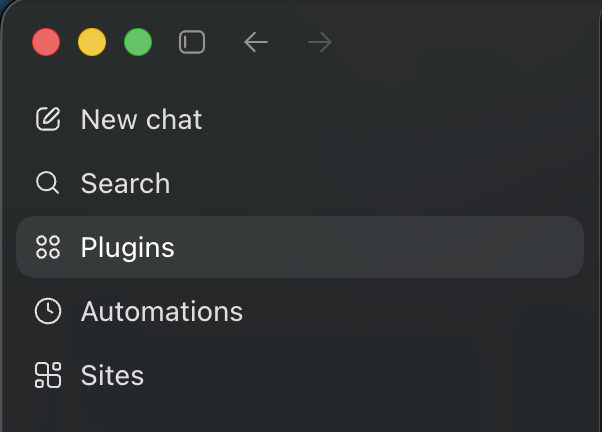
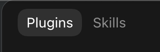
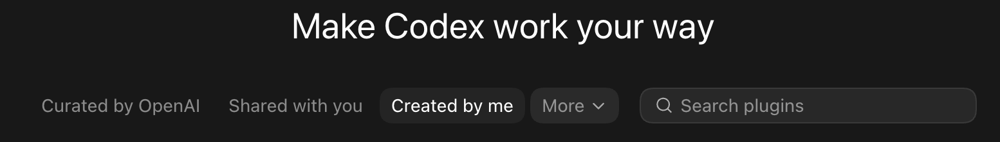
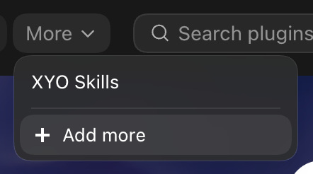
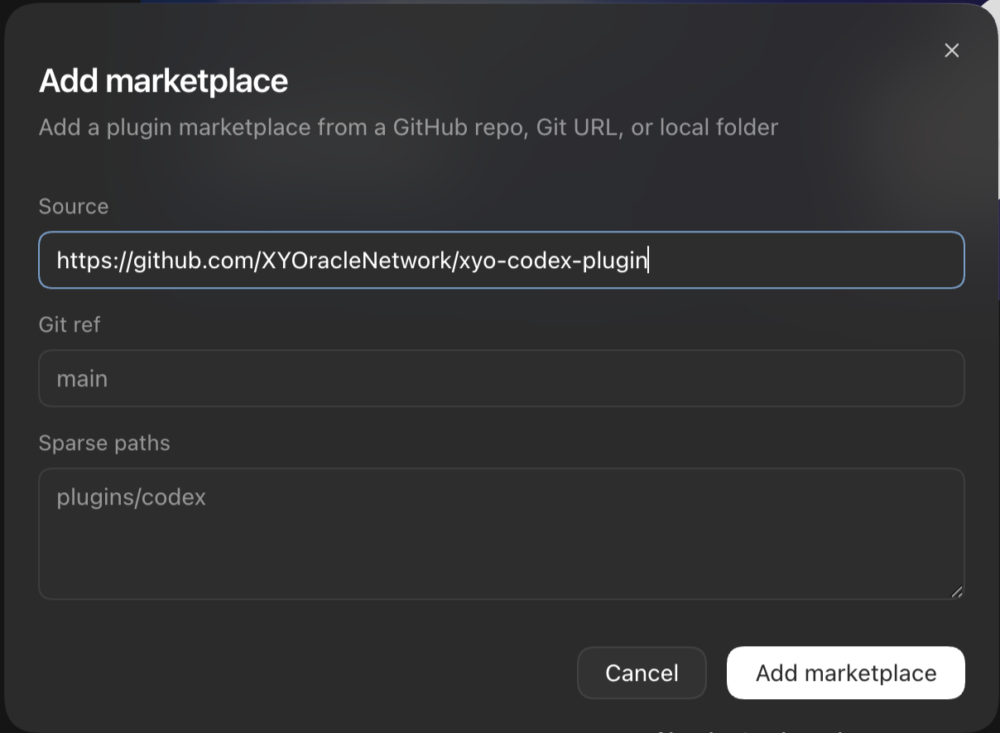
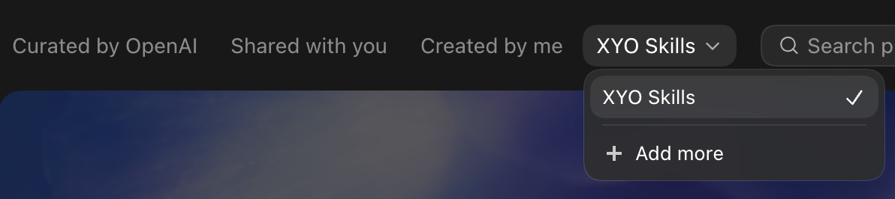
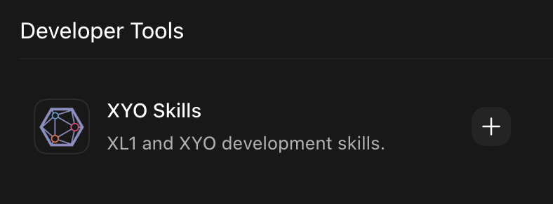
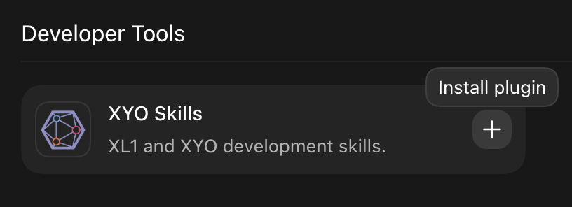
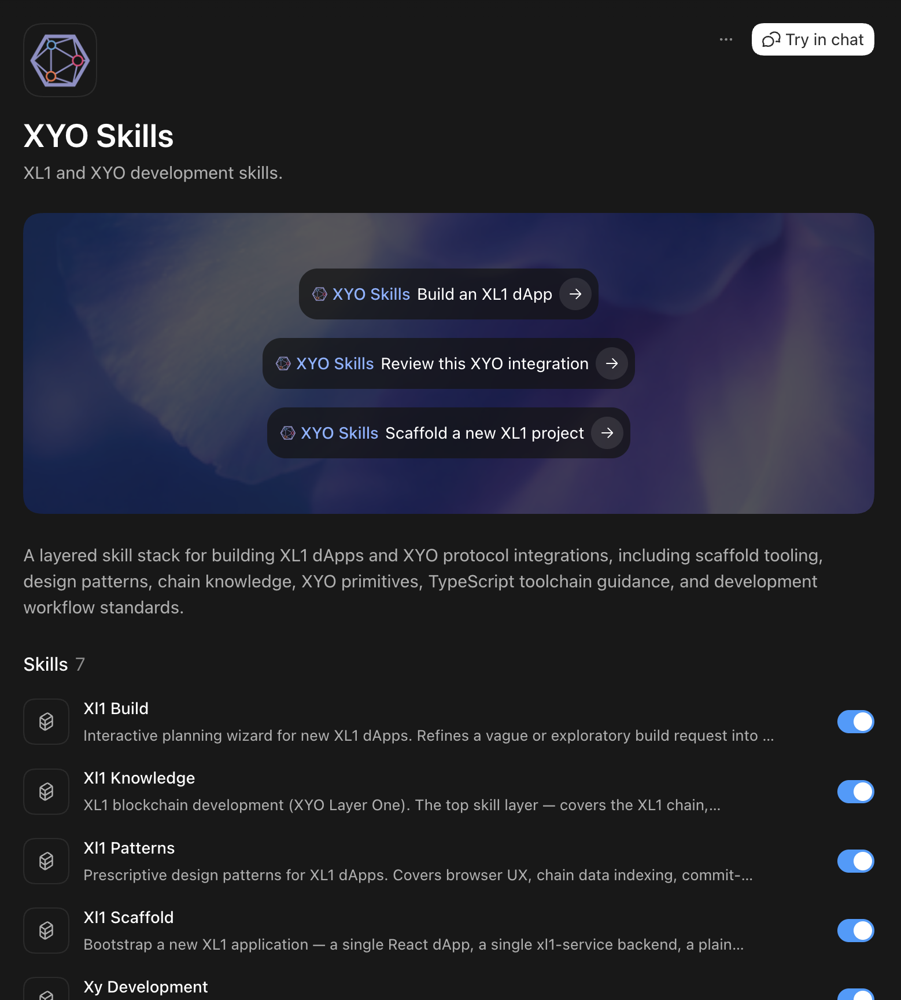

# xyo-codex-plugin

OpenAI Codex marketplace mirror for [`XYOracleNetwork/xyo-skills`](https://github.com/XYOracleNetwork/xyo-skills) — XL1 / XYO development skills for AI coding assistants.

This repository is **auto-generated** from the source repo on each release. Do not open PRs against this repo; file issues and contribute at [xyo-skills](https://github.com/XYOracleNetwork/xyo-skills) instead.

## Install

You can install the XYO Skills plugin either through the Codex desktop UI or with the `codex` CLI.

### Via the UI

1. Open the Codex sidebar and click **Plugins**.

   

2. Make sure the **Plugins** tab is selected (not **Skills**).

   

3. On the **Make Codex work your way** page, open the **More** dropdown in the filter row.

   

4. Click **+ Add more**.

   

5. Fill in the **Add marketplace** dialog:

   - **Source**: `https://github.com/XYOracleNetwork/xyo-codex-plugin`
   - **Git ref**: `main`
   - **Sparse paths**: `plugins/codex`

6. Click the **Add marketplace** button at the bottom of the dialog.

   

7. Back on the marketplace page, open the **More** dropdown again.

8. Select **XYO Skills** from the dropdown to filter the page to that marketplace.

   

9. Under **Developer Tools**, find the **XYO Skills** card and click the **+** button (hover shows *Install plugin*).

   

   

   After install, the plugin page opens and lists the bundled XL1 / XYO skills:

   

Start a new Codex thread after installing so the skill list is refreshed.

### Via textual commands

```shell
codex plugin marketplace add XYOracleNetwork/xyo-codex-plugin --ref main
codex plugin add xyo-skills@xyo-skills
```

Start a new Codex thread after installing or updating so the skill list is refreshed.

## Other distributions

| Tool | Repo |
|---|---|
| Claude Code | [`XYOracleNetwork/xyo-claude-plugin`](https://github.com/XYOracleNetwork/xyo-claude-plugin) |
| Skills.sh | [`XYOracleNetwork/xyo-skills`](https://github.com/XYOracleNetwork/xyo-skills) |

## License

[LGPL-3.0-only](./LICENSE) — same as the source repo.
